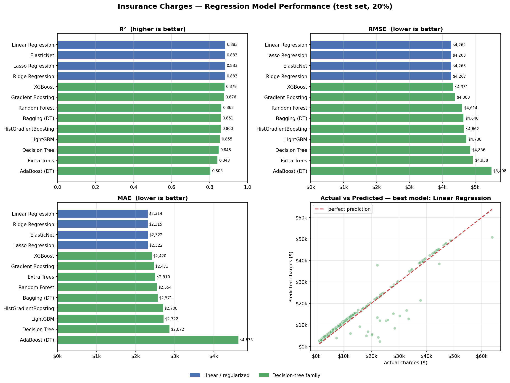

# 💸 Insurance Charges — ML Model Dashboard

An interactive **Streamlit** dashboard that predicts annual **medical insurance charges**
and benchmarks **13 regression models** — linear/regularized methods against the full
decision-tree family — with feature engineering, on the classic insurance dataset
(1,338 policyholders).

[](https://www.python.org/)
[](https://streamlit.io/)
[](LICENSE)

---

## ✨ Features

- **📊 Data Explorer** — distribution of charges, smoking as the dominant cost driver,
  charges vs. age/BMI, and a correlation heatmap.
- **🏆 Model Performance** — sorted R² / MAE / RMSE table (with optional 5-fold CV R²),
  side-by-side metric bar charts, plus per-model *actual-vs-predicted*, residual, and
  feature-importance plots.
- **🔮 Predict** — enter a policyholder's details and get a live charge estimate from any
  model, see where it falls in the population, and compare agreement across the top models.
- **ℹ️ About** — methodology, feature engineering, and metric definitions.

## 🧠 Models compared

| Linear / regularized | Decision-tree family |
| --- | --- |
| Linear Regression, Ridge, Lasso, ElasticNet | Decision Tree, Random Forest, Extra Trees, Bagging, AdaBoost, Gradient Boosting, HistGradientBoosting, XGBoost, LightGBM |

Linear models are standardized and have their penalty auto-tuned by cross-validation;
tree models are scale-invariant and used directly. XGBoost/LightGBM are optional — the app
degrades gracefully if those wheels aren't available.

## 🗂️ Project structure

```
insurance-charges-dashboard/
├── app.py                  # Streamlit dashboard (UI)
├── pipeline.py             # Data, feature engineering, models, evaluation (pure Python)
├── requirements.txt        # Dependencies
├── README.md
├── LICENSE
├── .gitignore
├── .streamlit/
│   └── config.toml         # Theme + server config
└── data/
    └── InsuranceLR.csv      # Dataset
```

## 🚀 Run locally

```bash
# 1. Clone
git clone https://github.com/<your-username>/insurance-charges-dashboard.git
cd insurance-charges-dashboard

# 2. (Recommended) create a virtual environment
python -m venv .venv
source .venv/bin/activate          # Windows: .venv\Scripts\activate

# 3. Install dependencies
pip install -r requirements.txt

# 4. Launch
streamlit run app.py
```

The app opens at `http://localhost:8501`. The first load trains all models (a few
seconds); results are cached so subsequent interactions are instant.

## ☁️ Deploy to Streamlit Community Cloud (free)

1. Push this repository to **GitHub** (see below).
2. Go to **[share.streamlit.io](https://share.streamlit.io)** and sign in with GitHub.
3. Click **New app** → select your repo, branch `main`, and main file `app.py`.
4. Click **Deploy**. Streamlit installs `requirements.txt` and builds the app.

That's it — you'll get a public URL like
`https://<your-app-name>.streamlit.app`. Add it to the top of this README.

> **Tip:** if a build ever fails on `xgboost` or `lightgbm`, you can remove those two
> lines from `requirements.txt` — the dashboard still runs with the scikit-learn models.

## 📦 Push to GitHub

```bash
git init
git add .
git commit -m "Insurance charges ML dashboard"
git branch -M main
git remote add origin https://github.com/<your-username>/insurance-charges-dashboard.git
git push -u origin main
```

## 📈 Results (test set, seed 42)



Once the **`smoker × bmi`** interaction is engineered, the simple linear models match the
gradient-boosting ensembles — interpretable models that perform.

| Rank | Model | R² | MAE | RMSE |
| --- | --- | --- | --- | --- |
| 1 | Linear Regression | 0.883 | $2,314 | $4,262 |
| 2 | Lasso / ElasticNet | 0.883 | $2,322 | $4,263 |
| 4 | Ridge Regression | 0.883 | $2,315 | $4,267 |
| 5 | XGBoost | 0.879 | $2,420 | $4,331 |
| 6 | Gradient Boosting | 0.876 | $2,473 | $4,388 |
| … | … | … | … | … |

*Exact numbers depend on the random seed; the ranking is stable.*

## 🛠️ Tech stack

Python · scikit-learn · XGBoost · LightGBM · Plotly · Streamlit · pandas · NumPy

## 📄 License

Released under the [MIT License](LICENSE).
